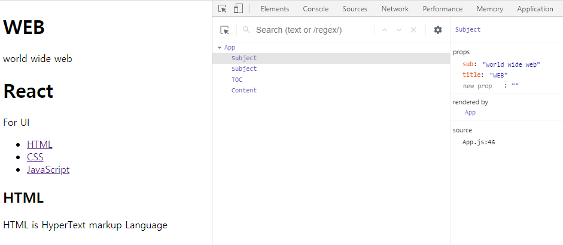

# d. props, state, key

## props
props는 html의 attribute 값을 동적으로 변경할 수 있도록 하는 값이다.
다시 말해, 상위 컴포넌트에서 하위 컴포넌트로 값을 전달할 수 있다.
```javascript
class App extends Component {
  render() {
    // props를 사용자 정의 태그 옆에 마치 html의 attribute 속성처럼 적을 수 있다.
    return (
      <div className="App">
        <Subject title="WEB" sub="world wide web"/>
      </div>
    );
  };
}

class Subject extends Component {
  // this.props를 통해 서브 컴포넌트가 props를 받을 수 있다.
  // {}를 이용하여 값을 출력할 수 있다.
  render() {
    return (
      <header>
        <h1>{this.props.title}</h1>
        {this.props.sub}
      </header>
    );
  }
}

```

#### [React Developer Tools](https://chrome.google.com/webstore/detail/react-developer-tools/fmkadmapgofadopljbjfkapdkoienihi)을 통해 본 컴포넌트의 Props

props를 변경하고 Enter를 누르면, 실시간으로 값을 변경할 수도 있다.

<p align="center">
  
</p>

<hr />

## state
props : 컴포넌트를 이용하는 사용자 및 개발자에게 중요한 값들<br>
state: 외부에서 알아서는 안 되는 컴포넌트 내부에서 사용되는 값들<br>
철저히 props와 분리되서 사용된다.

```javascript
class App extends Component {
  // 생성자: render 함수가 실행되기 전 state를 초기화
  //state: 내부적으로 사용하는 값.
  constructor(props){
    super(props)
    this.state = {
      subject:{title: 'WEB', sub: 'World Wide Web!'}
    }
  }
  render() {
    // 상위 컴포넌트에서 하위 컴포넌트로 값을 줄 때 props를 사용한다.
    // 컴포넌트에 props를 넘겨줄 때, 하드코딩이 아닌 state값을 던져준다.
    return (
      <div className="App">
        <Subject title={this.state.subject.title} sub={this.state.subject.title}/>
      </div>
    );
  };
}
```
