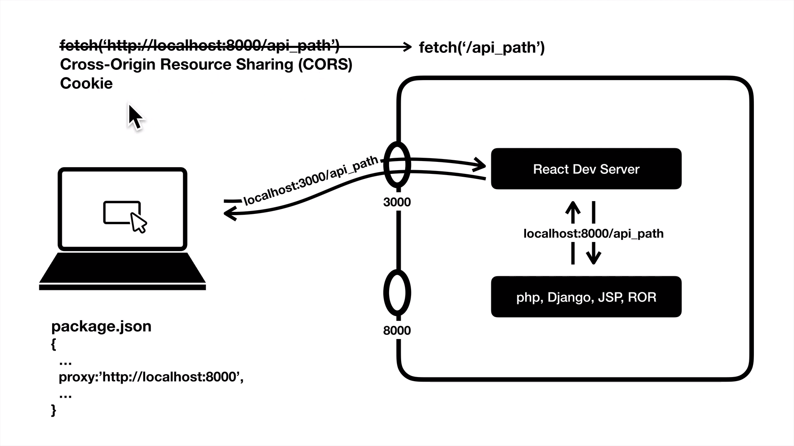
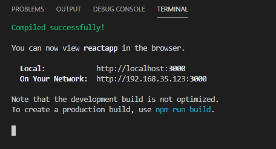
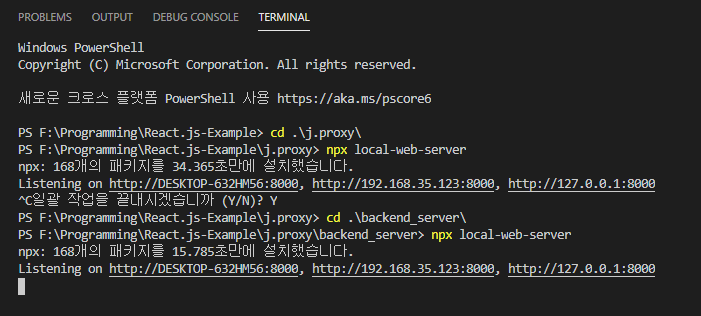

# 프록시

## 기존 개발 환경의 문제점

</img>

React를 사용하면 개발자는 React Dev Server와 백엔드(Django, Apache, php...)의 두 개의 서버를 사용하게 된다.<br>
물론 React Dev Server는 개발 시에만 사용된다.<br>
두 개의 서버는 포트가 다르다.<br>
로그인 작업을 백엔드에 구현을 해놨다면, 클라이언트에서 로그인 요청을 하면 백엔드 측에서 토큰이 담긴 쿠키를 전달한다. 그런데 클라이언트 측에서 사용자 정보를 요청할 때 8000번 포트가 아닌 3000번 포트로 잘못 요청할 시, 백엔드는 사용자를 다른 사용자로 오인한다.<br> 
이 것을 해결하는 것이 Proxy이다.

## 설정

프록시를 설정하기 전 AJAX 통신을 할 때 아래와 같이 요청해야만 한다.

```javascript
fetch('http://localhost:8000/api_path');
```
package.json에 다음과 같이 입력한다.
```json
{
    "proxy": "http://localhost:8000", 
}
```

이렇게 설정해놓으면  다음과 같이 host와 포트번호를 쓰지 않고 요청할 수 있다.
```javascript
fetch('/api_path');
```

## 동작 원리
요청을 
```javascript 
fetch('/api_path');
```
로 날리면 실제로 요청 URL은 localhost:3000/api_path 가 되며
이 요청을 React Dev Server가 받는다.<br>
React Dev Server가 api_path라는 정보가 없다는 것을 알면, <br>
package.json에 적혀있는 proxy를 확인하고 해당하는 3000번 포트의 서버에 접속한다.
요청한 데이터를 백엔드 서버가 React Dev Server에게 주면<br>
React Dev Server가 클라이언트에게 응답을 대신(=Proxy) 해준다.<br>
대신 해준다는 뜻의 Proxy와 Server가 합쳐져 대신 응답을 하는 서버를 Proxy Server라고 한다.<br>
여기서는 React Dev Server가 Proxy Server이다.<br>

프록시는 [CORS(Cross-Origin Resource Sharing)](https://developer.mozilla.org/ko/docs/Web/HTTP/CORS)에 위반되지 않으며 Cookie도 공유한다.

## 로컬 서버 실행하기

data.json을 get방식으로 요청할 수 있는 서버를 다음 명령어로 즉시 만들 수 있다.
```
npx local-web-server json_파일이_있는_폴더_경로
```

## React Dev Server와 백엔드 서버가 실행된 모습.
</img></img>